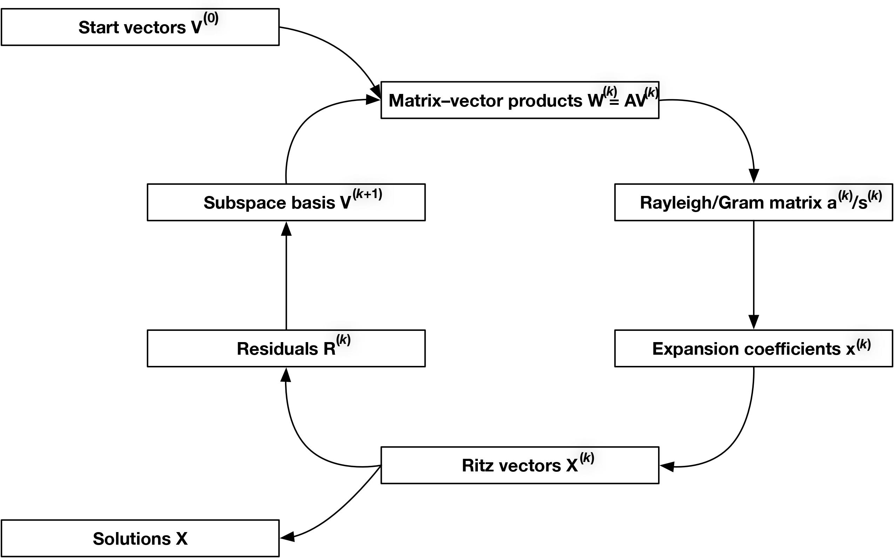

***********************
Background and Notation
***********************

=======================
Krylov Subspace Methods
=======================

**Overview of Krylov Subspace Methods**
^^^^^^^^^^^^^^^^^^^^^^^^^^^^^^^^^^^^^^^

Krylov subspace methods project a large matrix problem on to a smaller subspace,
where the smaller subspace problem is solved. The Krylov subspace is
iteratively solved, until the solution is found to within a numerical threshold 
or the maximum number of iterations of reached.

The libkrylov library is designed for matrix-free linear algebra, in which the
coefficient matrix is not constructed explicitly and is instead represented by
its matrix-vector products. All algorithms are blocked and can treat multiple
equations simultaneously. Additionally, multiple Krylov subspace solvers can
share a single matrix-vector product function for efficiency. See :ref:`Quick
Start for Fortran Programmers` and :ref:`Quick Start for C/C++ Programmers` for
examples.

**General Structure**
^^^^^^^^^^^^^^^^^^^^^

In Krylov subspace methods, the solution vectors are approximated as

:math:`\mathbf{X}^{(k)} = \mathbf{V}^{(k)}\mathbf{x}^{(k)},`

The Rayleigh matrix

:math:`\mathbf{a}^{(k)} = \mathbf{V}^{(k)\dagger}\mathbf{A}\mathbf{V}^{(k)}`

is the projection of the matrix :math:`\mathbf{A}` onto the Krylov
subspace. The projection of the right-hand side (RHS) matrix :math:`\mathbf{P}`
of (shifted) linear equations is denoted as

:math:`\mathbf{p}^{(k)} = \mathbf{V}^{(k)\dagger}\mathbf{P}`

The columns of the residual matrix :math:`\mathbf{R}^{(k)}` are used
to construct the basis of the subsequent Krylov subspace
:math:`\mathcal{K}^{(k+1)}` of dimension :math:`q_{k+1} = q_k + p`.
:ref:`preconditioning` of the residuals is often
crucial for fast convergence of Krylov subspace algorithms and consists
of computing

:math:`\tilde{\mathbf{R}}^{(k)} = \mathbf{K}^{-1}\mathbf{R}^{(k)},`

where :math:`\mathbf{K}` is an invertible :math:`n\times n` matrix
that is in some sense an approximation to :math:`\mathbf{A}` (chosen
here as the diagonal of :math:`\mathbf{A}`).

The matrix of basis vectors of :math:`\mathcal{K}^{(k+1)}` is expanded
as

:math:`\mathbf{V}^{(k+1)} = [\mathbf{V}^{(k)} ; \tilde{\mathbf{R}}^{(k)}].`

Given a :ref:`user defined matrix-vector
product <Quick Start for Fortran Programmers>`, the Krylov
subspace algorithm proceeds as shown in figure below:

**Equation Types** 
^^^^^^^^^^^^^^^^^^

The following equation solvers are available in
the library:

-  Eigenproblems; :math:`\mathbf{A}\mathbf{X} = \mathbf{X}{\Omega}`

-  Linear equations; :math:`\mathbf{A}\mathbf{X} = \mathbf{P}`

-  Shifted-linear equations; :math:`\mathbf{A}\mathbf{X} - \mathbf{X}{\omega} = \mathbf{P}`

--------------

===============
Preconditioning
===============

For numerical precision and efficiency, the residuals are calculated on the
full space explicitly to obtain their 2-norms.

**Residual Calculation**                                     
^^^^^^^^^^^^^^^^^^^^^^^^

The residual for the k-th solution is computed as follows    

 :math:`\mathbf{R}_{[k]}=[(\mathbf{AV}_{[k]})\mathbf{x}_{[k]}] -[\mathbf{V}_{[k]}(\mathbf{x}_{[k]}\mathbf{\Omega}_{[k]})]` for eigenvalue equations.                                    

 :math:`\mathbf{R}_{[k]}=[(\mathbf{AV}_{[k]})\mathbf{x}_{[k]}]-\mathbf{P}` for linear equations.                                        

 :math:`\mathbf{R}_{[k]}=[(\mathbf{AV}_{[k]})\mathbf{x}_{[k]}]-[\mathbf{V}_{[k]}(\mathbf{x}_{[k]}\mathbf{\omega}_{[k]})]-\mathbf{P}` for shifted-linear equations.

**Residual Preconditioning**
^^^^^^^^^^^^^^^^^^^^^^^^^^^^

For improved convergence, preconditioning of residuals is advised. The
default preconditioner is set by calling the function
``krylov_set_enum_option(key,string)`` before adding any spaces.

.. code:: fortran

   error = krylov_set_enum_option('preconditioner', 'n')
   if (error /= 0) stop 1

=========================
Available Preconditioners
=========================

========== =========================================
Identifier Description
========== =========================================
'n'        null preconditioner
'c'        Conjugate Gradient preconditioner
'd'        Davidson preconditioner
'j'        Jacobi-Davidson preconditioner, variant 1
'a'        Jacobi-Davidson preconditioner, variant 2
========== =========================================

Using identifier 'n', null preconditioning is computed as:

:math:`\tilde{\mathbf{R}_{[k]}}=\mathbf{R}_{[k]}` for all problems

Using identifier 'c', conjugate-gradient preconditioning is computed as:

:math:`\tilde{\mathbf{R}_{[k]}}=\mathbf{K}^{-1}\mathbf{R}_{[k]}` for
all problems

Using identifier 'd', Davidson preconditioning is computed as:

:math:`\tilde{\mathbf{R}_{[k]}}=(\mathbf{K} - \mathbf{\Omega}_{[k]})^{-1}\mathbf{R}_{[k]}`
for eigenvalue problem

:math:`\mathbf{R}_{[k]}=(\mathbf{K} - \mathbf{\omega}_{[k]})\mathbf{R}_{[k]}`
for shifted linear problem

which is equivalent to the Conjugate Gradient preconditioning for the
linear problem.

Using identifier 'j', Jacobi-Davidson, variant 1 preconditioning is computed as:

:math:`\tilde{\mathbf{R}}^{(k)} = (\mathbf{K}-\mathbf{\Omega}^{(k)})^{-1}\mathbf{R}^{(k)}-\varepsilon(\mathbf{K}-\mathbf{\Omega}^{(k)})^{-1}\mathbf{X}^{(k)}`
for eigenvalue problems.

:math:`\tilde{\mathbf{R}}^{(k)} = \mathbf{K}^{-1}\mathbf{R}^{(k)}-\varepsilon\mathbf{K}^{-1}\mathbf{X}^{(k)}`
for linear problems.

:math:`\tilde{\mathbf{R}}^{(k)} = (\mathbf{K}-\mathbf{\omega}^{(k)})^{-1}\mathbf{R}^{(k)}-\varepsilon(\mathbf{K}-\mathbf{\omega}^{(k)})^{-1}\mathbf{X}^{(k)}`
for shifted linear problems.

where

:math:`\varepsilon=\frac{\mathbf{X}^{(k)\dagger}\mathbf{K}^{-1}\mathbf{R}^{(k)}}{\mathbf{X}^{\dagger(k)}\mathbf{K}^{-1}\mathbf{X}^{(k)}}`

Using identifier 'a' , Jacobi-Davidson, variant 2 preconditioning is computed as
above by solving a linear problem of the form:

:math:`\sum_j\left(\mathbf{X}_i^{(k)\dagger}\mathbf{K}^{-1}\mathbf{X}_j^{(k)}\right)\varepsilon_{ij} = \mathbf{X}_i^{(k)\dagger}\mathbf{K}^{-1}\mathbf{R}_j^{(k)}`

**Jacobi-Davidson Variants**
^^^^^^^^^^^^^^^^^^^^^^^^^^^^

Jacobi-Davidson preconditioner, variant 1 applies preconditioning to each residual by projecting out
of the corresponding solution, while Jacobi-Davidson preconditioner, variant 2 projects out of all
solutions for each residual.

--------------

==================
Orthonormalization
==================

This library features different orthonormalization techniques. This is
controlled by a ``key`` and ``string`` in
``krylov_set_enum_option('key','string')``.

.. code:: fortran

   error = krylov_set_enum_option('orthonormalizer', 'o')
   if (error /= 0) stop 1

If the string is unrecognized, the orthonormalization defaults to the
orthonormal basis.

==========================
Available Orthonormalizers
==========================

========== ===========================
Identifier Description
========== ===========================
'o'        Orthonormal algorithm
'n'        Nonorthonormal algorithm
's'        Semi-Orthonormal algorithm
========== ===========================

Orthonormal Algorithm
^^^^^^^^^^^^^^^^^^^^^

This is the conventional Krylov subspace algorithm which requires orthonormal
subspace basis vectors. The orthonormalization step uses the modified
Gram-Schmidt (MGS) method. No additional transformations are needed.

Nonorthonormal Krylov Subspace Algorithm
^^^^^^^^^^^^^^^^^^^^^^^^^^^^^^^^^^^^^^^^

The nonorthonormal Krylov Subspace (nKs) method `1 <##%20References>`__
uses a nonorthonormal subspace basis, in which case the Gram/overlap
matrix

:math:`\mathbf{s}^{(k)} = \mathbf{V}^{(k)\dagger}\mathbf{V}^{(k)}`

is not equal to the identity matrix. The projected equations are thus
transformed using the Cholesky decomposition of the scaled Gram/overlap
matrix

:math:`\mathbf{L}\mathbf{L}^{\dagger} = \mathbf{d}^{-1/2}\mathbf{s}^{(k)}\mathbf{d}^{-1/2}`

as follows:

:math:`\tilde{\mathbf{a}}^{(k)} = \mathbf{L}^{-1}\mathbf{d}^{-1/2}\mathbf{a}^{(k)}\mathbf{d}^{-1/2}(\mathbf{L}^{-1})^{\dagger},`

:math:`\tilde{\mathbf{x}}^{(k)} = \mathbf{L}^{\dagger}\mathbf{d}^{1/2}\mathbf{x}^{(k)},`

:math:`\tilde{\mathbf{p}}^{(k)} = \mathbf{L}^{-1}\mathbf{d}^{-1/2}\mathbf{p}^{(k)}.`

The scaling by
:math:`\mathbf{L}\mathbf{L}^{\dagger} = \mathbf{d}^{-1/2}\mathbf{s}^{(k)}\mathbf{d}^{-1/2}`
is neccesary to reduce the condition number of :math:`\mathbf{s}`.

Semi-Orthonormal Algorithm
^^^^^^^^^^^^^^^^^^^^^^^^^^

Similar to the nks method, the semi-orthonormal variant orthonormalizes
the vectors against each other but not against the existing subspace.

References
----------

[1] F. Furche, B. Krull, B. D. Nguyen, J. Kwon, “Accelerating molecular
property calculations with nonorthonormal Krylov space methods”, *J.
Chem. Phys.* **144**\ (2016), 174105, `doi:
10.1063/1.4947245 <https://dx.doi.org/10.1063/1.4947245>`__.

========
Notation
========

**Symbols used:**

:math:`\mathbf{I}_d` is the identity matrix

:math:`\mathbf{A}` is the coefficient matrix of the problem

:math:`\mathbf{X}_j` is the exact solution to the problem

:math:`\Omega_j` is the exact eigenvalue of the problem

Special note:
:math:`\boldsymbol{\Omega}_j = \Omega_j \cdot \boldsymbol{I}_d` and
:math:`\boldsymbol{\omega}_j = \omega_j \cdot \boldsymbol{I}_d`, since
:math:`\boldsymbol{\Omega}` is usually a diagonal matrix of all
:math:`\Omega_j`

:math:`P_j` is the right hand side of the problem

:math:`\omega_j` is the input frequency of the problem

:math:`X_{j[k]}` is the solution on the full space at iteration *k*

:math:`\mathbf{R}_{j[k]}` are the residuals on the full space at
iteration *k*

:math:`\tilde{\mathbf{R}}_{j[k]}` are the preconditioned residuals on
the full space at iteration *k*

:math:`\Omega_{j[k]}` is the eigenvalue of the problem at iteration
*k*

:math:`\mathbf{V}_{[k]}` is the basis vectors projecting the full
space onto the krylov subspace at iteration *k*

:math:`\mathbf{s}_{[k]}` is the Gram/overlap matrix of the basis
vectors

:math:`x_{j[k]}` is the solution on the subspace at iteration *k*

:math:`\mathbf{a}_{[k]}` is the coefficient matrix projected onto the
subspace (Rayleigh matrix) at iteration *k*

:math:`p_{j[k]}` is the right hand side of the problem projected onto
the subspace at iteration *k*

:math:`\mathbf{d}_{[k]}` is the diagonal values of the Gram/overlap
matrix at iteration *k*
